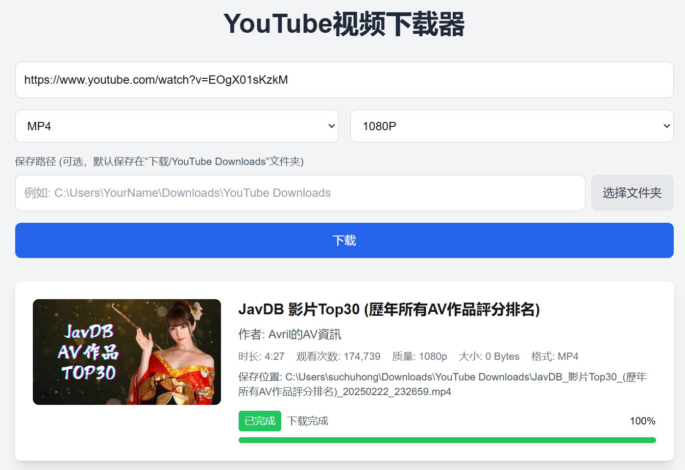
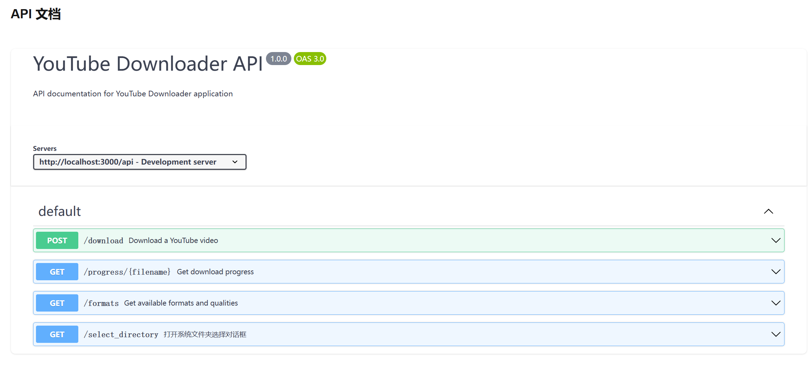

# YouTube Video Downloader

A modern web application for downloading YouTube videos with a user-friendly interface and powerful features.

[中文文档](#youtube-视频下载器)

## Screenshots

### Main Interface


### API Documentation


## Features

- Download YouTube videos and shorts in various formats (MP4, WEBM, MP3, 3GP)
- Multiple quality options (360p, 480p, 720p, 1080p, Best)
- Custom save location with folder picker
- Real-time download progress with status indicators
- Last used path memory
- Beautiful and responsive UI
- Full Chinese language support

## Tech Stack

- Frontend: Next.js 14, React, TypeScript, Tailwind CSS
- Backend: FastAPI, Python
- Video Processing: yt-dlp

## Prerequisites

- Node.js 18+ and npm
- Python 3.8+
- Windows OS (for native folder picker)

## Installation

1. Clone the repository:
```bash
git clone <repository-url>
cd youtube_download_2
```

2. Install backend dependencies:
```bash
cd backend
pip install -r requirements.txt
```

3. Install frontend dependencies:
```bash
cd ../frontend
npm install
```

## Running the Application

1. Start the backend server:
```bash
cd backend
python main.py
```
The backend will run on http://localhost:8000

2. Start the frontend development server:
```bash
cd frontend
npm run dev
```
The frontend will run on http://localhost:3000

## Usage

1. Open http://localhost:3000 in your browser
2. Paste a YouTube video URL
3. Select desired format and quality
4. Choose save location (optional)
5. Click download and monitor progress

## API Documentation

API documentation is available at http://localhost:3000/api-docs

---

# YouTube 视频下载器

一个现代化的 YouTube 视频下载工具，具有友好的用户界面和强大的功能。

## 界面截图

### 主界面


### API 文档界面


## 功能特点

- 支持下载 YouTube 视频和短视频
- 多种格式支持（MP4、WEBM、MP3、3GP）
- 多种清晰度选项（360p、480p、720p、1080p、最佳质量）
- 自定义保存位置，支持文件夹选择器
- 实时下载进度显示和状态指示
- 记住上次使用的保存路径
- 美观响应式的用户界面
- 完整的中文界面支持

## 技术栈

- 前端：Next.js 14、React、TypeScript、Tailwind CSS
- 后端：FastAPI、Python
- 视频处理：yt-dlp

## 环境要求

- Node.js 18+ 和 npm
- Python 3.8+
- Windows 操作系统（用于原生文件夹选择器）

## 安装步骤

1. 克隆仓库：
```bash
git clone <仓库地址>
cd youtube_download_2
```

2. 安装后端依赖：
```bash
cd backend
pip install -r requirements.txt
```

3. 安装前端依赖：
```bash
cd ../frontend
npm install
```

## 启动应用

1. 启动后端服务器：
```bash
cd backend
python main.py
```
后端服务将运行在 http://localhost:8000

2. 启动前端开发服务器：
```bash
cd frontend
npm run dev
```
前端服务将运行在 http://localhost:3000

## 使用说明

1. 在浏览器中打开 http://localhost:3000
2. 粘贴 YouTube 视频链接
3. 选择所需的格式和清晰度
4. 选择保存位置（可选）
5. 点击下载并查看进度

## API 文档

API 文档可在 http://localhost:3000/api-docs 查看 